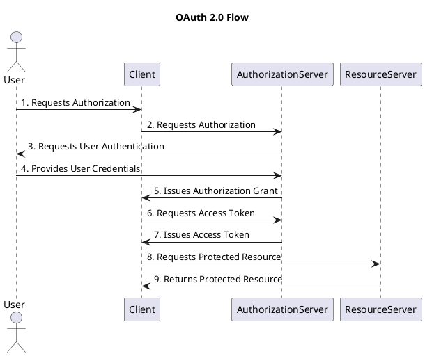

# 这是一个rust的学习笔记

# note 是里面的一些markdown笔记

# src 存放的是源码例子

sdsd

```plantuml
@startuml
title OAuth 2.0 Flow

actor User
User -> Client : 1. Requests Authorization
Client -> AuthorizationServer : 2. Requests Authorization
AuthorizationServer -> User : 3. Requests User Authentication
User -> AuthorizationServer : 4. Provides User Credentials
AuthorizationServer -> Client : 5. Issues Authorization Grant
Client -> AuthorizationServer : 6. Requests Access Token
AuthorizationServer -> Client : 7. Issues Access Token
Client -> ResourceServer : 8. Requests Protected Resource
ResourceServer -> Client : 9. Returns Protected Resource
@enduml
```
